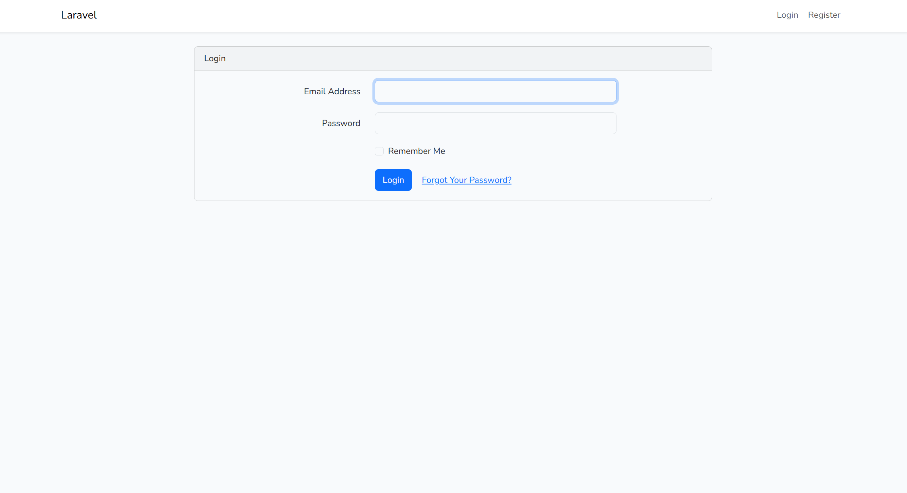
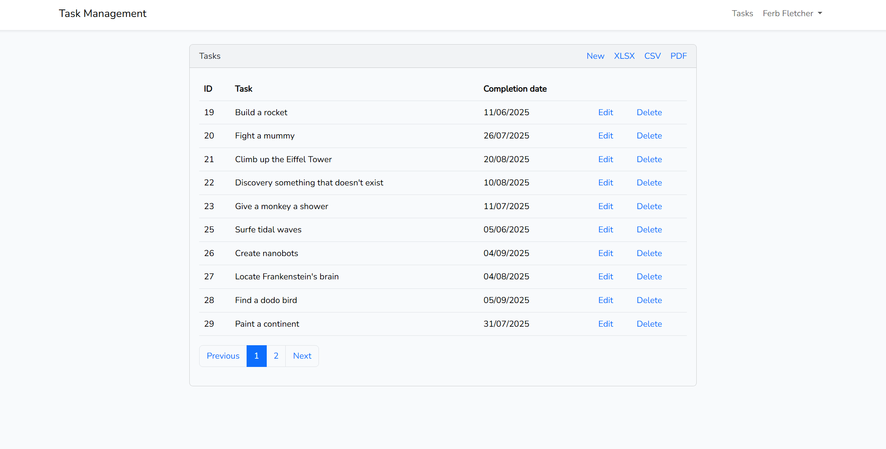
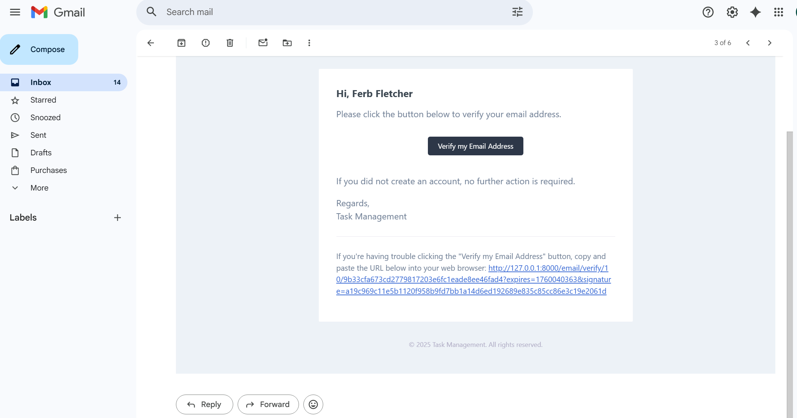

# Management_app

## About

Business application for managing orders and products.

## Features

- Task management system for creating, assigning, and tracking tasks 
- User registration and authentication with Laravel UI  
- Email notifications using Markdown Mailables (via Gmail SMTP)  
- Authentication middleware and password policy enforcement  
- Export of reports in XLSX, CSV, and PDF (with PDF streaming)  
- Database structure built with Migrations, Seeders, and Factories  
- Backend testing and data manipulation with Tinker  

---

## Technologies

### Backend
- PHP 7.4.33  
- Laravel 7.30.7  
- Eloquent ORM, Middlewares, Migrations, Seeders, Factories  
- Composer  

### Frontend
- Laravel UI (Bootstrap-based authentication scaffolding)  
- Blade Templates  
- Bootstrap  
- Node.js 14.16.0 & npm  

### Database
- MySQL (managed via MySQL Workbench)

### Reporting & Export
- DOMPDF (PDF generation)  
- Maatwebsite/Excel (XLSX & CSV export)

---

## Tools
- Postman (API testing)  
- Laravel Tinker (database testing)  
- Gmail SMTP (email integration via App Password)

---

## Screenshots

  
*Login page for user authentication.*

  
*Task list with options to create, edit, delete, and export tasks (XLSX, CSV, PDF)*

  
*Email address verification notification.*

---

## Installation and Setup

### 1. Clone the repository
```bash
git clone https://github.com/sarahwtz/task_management_app.git
cd task_management_app
```

### 2. Install PHP and Composer

Check your versions:
```bash
php -v 
composer -V 
```

If PHP or Composer is not installed:
```bash
sudo apt update
sudo apt install php7.4 php7.4-cli php7.4-mbstring php7.4-xml unzip curl
curl -sS https://getcomposer.org/installer | php
sudo mv composer.phar /usr/local/bin/composer
composer -V
```

### 3. Install project dependencies

```bash
composer install
```

### 4. Configure Laravel UI and Node.js

Install Laravel UI for authentication scaffolding:
```bash
composer require laravel/ui
php artisan ui bootstrap --auth
npm install
npm run dev
```

### 5. Configure environment file
```bash
cp .env.example .env
php artisan key:generate
```
edit your .env file and configure the following:

# Database
DB_CONNECTION=mysql
DB_HOST=127.0.0.1
DB_PORT=3306
DB_DATABASE=your_database
DB_USERNAME=your_username
DB_PASSWORD=your_password

# Mail (Gmail SMTP)
MAIL_MAILER=smtp
MAIL_HOST=smtp.gmail.com
MAIL_PORT=587
MAIL_USERNAME=your_email@gmail.com
MAIL_PASSWORD=your_app_password
MAIL_ENCRYPTION=tls
MAIL_FROM_ADDRESS=your_email@gmail.com
MAIL_FROM_NAME="${APP_NAME}"

### 6. Run migrations and seeders
```bash
php artisan migrate --seed
```
### 7. Test email sending

Use Postman to test email-related routes such as:

- Password reset
- New task notifications

### 8. Run the server

```bash
php artisan serve
```

## Database Structure

### users
| Column            | Type         | Description                          |
| ----------------- | ------------ | ------------------------------------ |
| id                | bigint       | Primary key                          |
| name              | varchar(100) | User's full name                      |
| email             | varchar(150) | User email (unique)                  |
| email_verified_at | timestamp    | Nullable — email verification date    |
| password          | varchar(255) | Hashed password (bcrypt/argon2)      |
| remember_token    | varchar(100) | Token for "remember me" functionality |
| created_at        | timestamp    | Record creation time                 |
| updated_at        | timestamp    | Record update time                   |

**Indexes / Constraints:**  
- Primary key on `id`  
- `email` UNIQUE  
- Hidden fields: `password`, `remember_token`  
- Relationships: `User hasMany Tarefas`  

---

### tarefas
| Column          | Type         | Description                         |
| --------------- | ------------ | ----------------------------------- |
| id              | bigint       | Primary key                         |
| user_id         | bigint       | Foreign key referencing `users.id`  |
| tarefa          | varchar(255) | Task title                           |
| completion_date | date         | Task due or completion date          |
| created_at      | timestamp    | Record creation time                 |
| updated_at      | timestamp    | Record update time                   |

**Indexes / Constraints:**  
- Primary key on `id`  
- Foreign key: `user_id` → `users(id)`  
- Relationships: `Tarefa belongsTo User`


